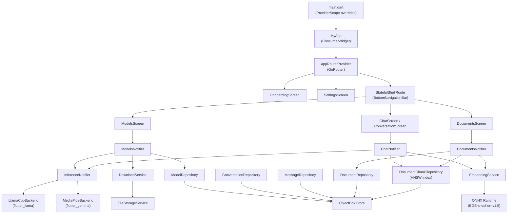
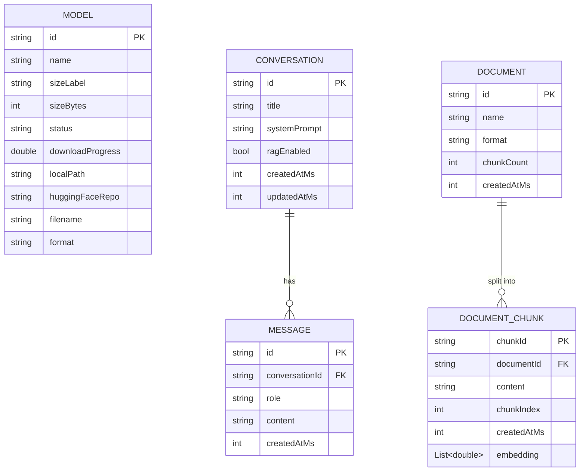
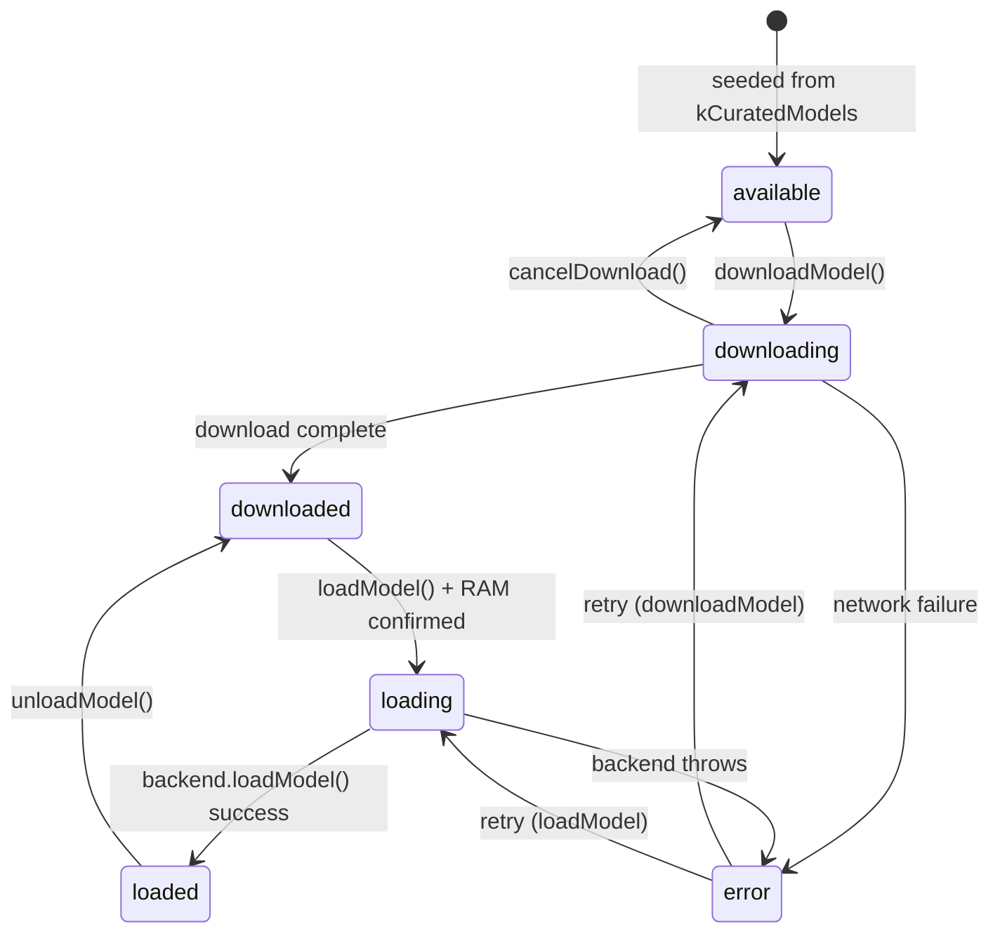
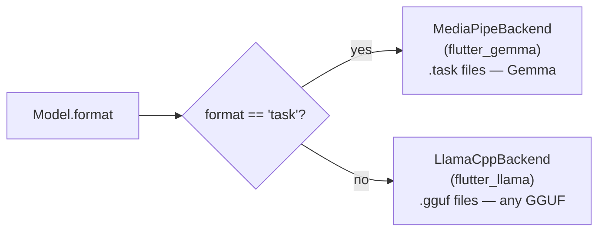
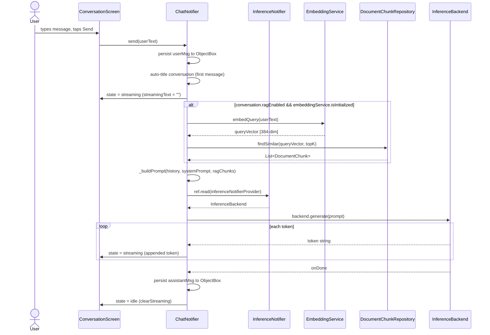
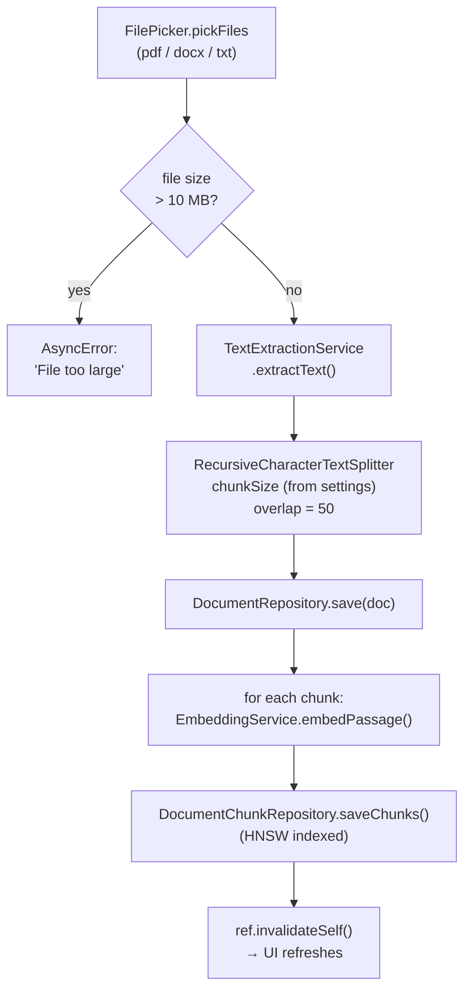
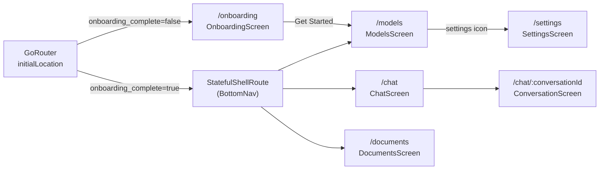
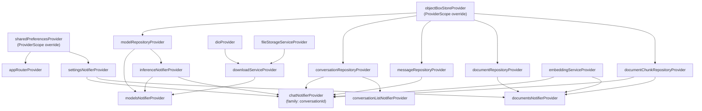

# Loki LLM

> **100% on-device LLM for Android & iOS** — private, offline, no cloud required.

**Version:** 1.0.0+1 | **Branch:** feature/phase-7-polish-ux | **SDK:** Dart ^3.5.3 / Flutter

---

## Table of Contents

1. [Overview](#1-overview)
2. [Architecture Overview](#2-architecture-overview)
3. [Tech Stack](#3-tech-stack)
4. [Directory Structure](#4-directory-structure)
5. [Implementation Phases](#5-implementation-phases)
   - [Phase 1 — Scaffold](#phase-1--scaffold)
   - [Phase 2 — LLM Engine](#phase-2--llm-engine)
   - [Phase 3 — Model Hub](#phase-3--model-hub)
   - [Phase 4 — Chat Core](#phase-4--chat-core)
   - [Phase 5 — Embedding Pipeline](#phase-5--embedding-pipeline)
   - [Phase 6 — RAG Pipeline](#phase-6--rag-pipeline)
   - [Phase 7 — Polish / UX](#phase-7--polish--ux)
6. [Data Model](#6-data-model)
7. [Model Lifecycle](#7-model-lifecycle)
8. [Inference Backend Selection](#8-inference-backend-selection)
9. [Chat & RAG Message Flow](#9-chat--rag-message-flow)
10. [Document Ingestion Pipeline](#10-document-ingestion-pipeline)
11. [Navigation & Routing](#11-navigation--routing)
12. [Provider Dependency Graph](#12-provider-dependency-graph)
13. [Testing](#13-testing)
14. [Build & Run](#14-build--run)

---

## 1. Overview

Loki LLM is a Flutter application that runs large language models entirely on-device — no internet connection required after the initial model download. It was built on the principle that AI assistants should respect user privacy: prompts, conversations, and documents never leave the device.

**Key capabilities:**

- Browse and download curated LLM models from Hugging Face (or sideload your own `.gguf` / `.task` files)
- Chat with any downloaded model with real-time token streaming
- Import PDF, DOCX, and TXT documents and ground conversations in their content (RAG)
- Configurable chunking and retrieval settings
- RAM-aware model loading with confirmation guard

---

## 2. Architecture Overview



---

## 3. Tech Stack

| Category | Library | Version | Purpose |
|---|---|---|---|
| **UI Framework** | flutter | SDK | Cross-platform UI |
| **State Management** | flutter_riverpod | ^2.5.1 | Reactive providers, notifiers |
| **State Management** | riverpod_annotation | ^2.3.5 | Code-gen annotations |
| **Immutable Models** | freezed_annotation | ^2.4.4 | Immutable data classes with copyWith |
| **JSON** | json_annotation | ^4.9.0 | JSON serialization |
| **Database** | objectbox | ^4.0.2 | On-device NoSQL + HNSW vector index |
| **Database** | objectbox_flutter_libs | ^4.0.2 | ObjectBox native libs for Flutter |
| **Navigation** | go_router | ^14.3.0 | Declarative routing, deep links |
| **Persistence** | shared_preferences | ^2.3.2 | Settings and onboarding flag |
| **LLM Backend** | flutter_gemma | ^0.11.8 | MediaPipe inference for `.task` files |
| **LLM Backend** | flutter_llama | ^1.1.2 | llama.cpp inference for `.gguf` files |
| **Networking** | dio | ^5.9.2 | Model downloads with progress |
| **File Picker** | file_picker | ^10.3.10 | Sideload models & ingest documents |
| **Storage Paths** | path_provider | ^2.1.5 | App documents directory |
| **RAM Check** | system_info_plus | ^0.0.6 | Query available physical memory |
| **Embeddings** | onnxruntime | ^1.4.1 | Run BGE-small-en-v1.5 ONNX model |
| **Tokenizer** | dart_wordpiece | ^1.1.0 | WordPiece tokenization for BERT models |
| **Doc Parsing** | flutter_pdf_text | ^0.9.0 | Extract text from PDF files |
| **Doc Parsing** | docx_to_text | ^1.0.1 | Extract text from DOCX files |
| **Text Splitting** | langchain | ^0.7.7+2 | `RecursiveCharacterTextSplitter` |
| **Code Generation** | build_runner | ^2.4.9 | Drives freezed / riverpod_generator |
| **Code Generation** | riverpod_generator | ^2.4.3 | Generate provider boilerplate |
| **Code Generation** | freezed | ^2.5.7 | Generate immutable class boilerplate |
| **Code Generation** | json_serializable | ^6.8.0 | Generate `fromJson` / `toJson` |
| **Code Generation** | objectbox_generator | ^4.0.2 | Generate ObjectBox entity bindings |

---

## 4. Directory Structure

```
lib/
├── main.dart                          # App entry point — ProviderScope, store init
├── objectbox.g.dart                   # Generated ObjectBox store code
│
├── core/
│   ├── database/
│   │   └── objectbox_store.dart       # Opens ObjectBox store (async)
│   ├── engine/
│   │   ├── inference_backend.dart     # Abstract base class for LLM backends
│   │   ├── backend_selector.dart      # backendForModel() — format → backend
│   │   ├── llama_cpp_backend.dart     # flutter_llama wrapper (.gguf)
│   │   └── mediapipe_backend.dart     # flutter_gemma wrapper (.task)
│   ├── providers/
│   │   ├── objectbox_provider.dart    # objectBoxStoreProvider
│   │   ├── shared_preferences_provider.dart
│   │   ├── inference_provider.dart    # InferenceNotifier (load/unload)
│   │   ├── embedding_provider.dart    # embeddingServiceProvider
│   │   └── download_provider.dart     # dioProvider, fileStorageServiceProvider
│   ├── router/
│   │   └── app_router.dart            # appRouterProvider, _ScaffoldWithNavBar
│   └── services/
│       ├── download_service.dart      # Dio-based model download with progress
│       ├── embedding_service.dart     # EmbeddingService (ONNX BGE-small)
│       ├── file_storage_service.dart  # Model file path management
│       ├── ram_check_service.dart     # confirmLoad() dialog
│       └── text_extraction_service.dart  # PDF/DOCX/TXT → plain text
│
├── features/
│   ├── models/
│   │   ├── domain/
│   │   │   ├── model.dart             # Model freezed class + recommendationBadge
│   │   │   └── model_status.dart      # ModelStatus enum
│   │   ├── data/
│   │   │   ├── model_catalog.dart     # kCuratedModels list + huggingFaceDownloadUrl
│   │   │   ├── model_entity.dart      # ObjectBox entity for Model
│   │   │   └── model_repository.dart  # CRUD + seed from kCuratedModels
│   │   └── presentation/
│   │       ├── models_notifier.dart   # ModelsNotifier (download/load/sideload)
│   │       └── models_screen.dart     # ModelsScreen UI
│   │
│   ├── chat/
│   │   ├── domain/
│   │   │   ├── message.dart           # Message freezed class
│   │   │   ├── message_role.dart      # MessageRole enum (user/assistant)
│   │   │   └── conversation.dart      # Conversation freezed class
│   │   ├── data/
│   │   │   ├── message_entity.dart    # ObjectBox entity for Message
│   │   │   ├── message_repository.dart
│   │   │   ├── conversation_entity.dart
│   │   │   └── conversation_repository.dart
│   │   └── presentation/
│   │       ├── chat_notifier.dart     # ChatNotifier (send, stream, RAG)
│   │       ├── conversation_list_notifier.dart
│   │       ├── chat_screen.dart       # Conversation list
│   │       └── conversation_screen.dart  # Message thread + input
│   │
│   ├── documents/
│   │   ├── domain/
│   │   │   ├── document.dart          # Document freezed class
│   │   │   └── document_chunk.dart    # DocumentChunk freezed class
│   │   ├── data/
│   │   │   ├── document_entity.dart
│   │   │   ├── document_repository.dart
│   │   │   ├── document_chunk_entity.dart  # @HnswIndex annotation
│   │   │   └── document_chunk_repository.dart  # findSimilar() HNSW search
│   │   └── presentation/
│   │       ├── documents_notifier.dart    # DocumentsNotifier (ingest pipeline)
│   │       └── documents_screen.dart
│   │
│   ├── settings/
│   │   ├── domain/
│   │   │   └── app_settings.dart      # AppSettings (chunkSize, topK)
│   │   └── presentation/
│   │       ├── settings_notifier.dart # SettingsNotifier (SharedPreferences-backed)
│   │       └── settings_screen.dart   # Sliders for chunkSize / topK
│   │
│   └── onboarding/
│       └── presentation/
│           └── onboarding_screen.dart # 3-page PageView + onboarding_complete flag

test/
├── widget_test.dart       # App smoke test
├── engine_test.dart       # InferenceBackend abstractions
├── domain_test.dart       # Freezed model constructors / computed properties
├── chat_test.dart         # ChatNotifier prompt building, state transitions
├── embedding_test.dart    # EmbeddingService init + cosine similarity
├── rag_test.dart          # Document ingestion + HNSW retrieval
├── download_test.dart     # DownloadService progress / cancel
├── settings_test.dart     # SettingsNotifier defaults + mutations
├── onboarding_test.dart   # Onboarding flag read/write
└── polish_test.dart       # Recommendation badges, RAM guard dialog
```

---

## 5. Implementation Phases

### Phase 1 — Scaffold

**What was built:**
- Flutter project skeleton with `pubspec.yaml` fully populated (all runtime and dev dependencies)
- `analysis_options.yaml` / `flutter_lints` enabled
- Asset declarations: `assets/models/bge-small-en-v1.5-int8.onnx`, `assets/vocab.txt`
- ObjectBox store setup with `openObjectBoxStore()` async initializer

**Key files introduced:**
- `pubspec.yaml`
- `lib/core/database/objectbox_store.dart`

**Design decisions:**
- All dependencies pinned upfront so every subsequent phase could import without `pub get` churn
- ObjectBox chosen over SQLite for its native vector index (HNSW) support — avoids a separate vector DB

---

### Phase 2 — LLM Engine

**What was built:**
- Pluggable `InferenceBackend` abstract class (`loadModel`, `generate`, `unloadModel`, `isLoaded`)
- `LlamaCppBackend` — wraps `flutter_llama` for `.gguf` GGUF-format models
- `MediaPipeBackend` — wraps `flutter_gemma` for `.task` Gemma models (MediaPipe runtime)
- `backendForModel(Model)` selector function: chooses backend based on `model.format`
- `InferenceNotifier` (Riverpod) — manages the single loaded backend instance; exposes `AsyncValue<InferenceBackend?>`

**Key files:**
- `lib/core/engine/inference_backend.dart`
- `lib/core/engine/backend_selector.dart`
- `lib/core/engine/llama_cpp_backend.dart`
- `lib/core/engine/mediapipe_backend.dart`
- `lib/core/providers/inference_provider.dart`

**Design decisions:**
- `base class` (not `abstract`) so subclasses that miss an override get `UnimplementedError` at runtime rather than compile error — intentional for the plugin abstraction boundary
- `generate()` returns `Stream<String>` for token streaming; callers use `.listen()` directly

---

### Phase 3 — Model Hub

**What was built:**
- `Model` freezed class with `id`, `name`, `sizeLabel`, `sizeBytes`, `status`, `downloadProgress`, `localPath`, `huggingFaceRepo`, `filename`, `format`
- `ModelStatus` enum: `available`, `downloading`, `downloaded`, `loading`, `loaded`, `error`, `paused`
- `kCuratedModels` — 3 curated entries (Gemma3 270M, Phi-3 Mini, Llama 3.2 3B)
- `ModelRepository` — ObjectBox-backed, seeds from `kCuratedModels` on first open
- `DownloadService` — Dio download with real-time progress callbacks; cancel token support
- `FileStorageService` — maps model ID → absolute file path in app documents directory
- `RamCheckService` — queries `system_info_plus` and shows confirmation dialog if model size > available RAM × 0.6
- `ModelsNotifier` — orchestrates download/cancel/load/unload/sideload
- `ModelsScreen` — list with status-driven trailing widget (download, cancel, play, stop, retry)

**Key files:**
- `lib/features/models/domain/model.dart`
- `lib/features/models/data/model_catalog.dart`
- `lib/features/models/data/model_repository.dart`
- `lib/features/models/presentation/models_notifier.dart`
- `lib/features/models/presentation/models_screen.dart`
- `lib/core/services/download_service.dart`
- `lib/core/services/file_storage_service.dart`
- `lib/core/services/ram_check_service.dart`

**Design decisions:**
- `Model` is a pure domain object (freezed, JSON-serializable); it is converted to/from `ModelEntity` for ObjectBox persistence — separates domain from persistence concerns
- Sideload path uses `file_picker` to let users load arbitrary `.gguf`/`.task` files not in the catalog

---

### Phase 4 — Chat Core

**What was built:**
- `Message` freezed class (`id`, `conversationId`, `role`, `content`, `createdAtMs`)
- `MessageRole` enum (`user`, `assistant`)
- `Conversation` freezed class (`id`, `title`, `systemPrompt`, `ragEnabled`, `createdAtMs`, `updatedAtMs`)
- `MessageRepository` / `ConversationRepository` — ObjectBox-backed CRUD
- `ChatNotifier` — per-conversation notifier (`build(conversationId)`) that streams tokens from the loaded backend, persists messages, and auto-titles conversations from the first message
- `ChatScreen` — conversation list with new-conversation FAB
- `ConversationScreen` — scrollable message thread + text input with streaming indicator

**Key files:**
- `lib/features/chat/domain/message.dart`
- `lib/features/chat/domain/conversation.dart`
- `lib/features/chat/data/message_repository.dart`
- `lib/features/chat/data/conversation_repository.dart`
- `lib/features/chat/presentation/chat_notifier.dart`
- `lib/features/chat/presentation/conversation_screen.dart`

**Design decisions:**
- `ChatNotifier` is a family notifier keyed by `conversationId` — each conversation has isolated state and a separate `StreamSubscription` that is cancelled on dispose
- A 60-second per-token timeout prevents the UI from hanging if the model stalls
- Prompt format uses simple `Human:` / `Assistant:` prefixes to remain backend-agnostic

---

### Phase 5 — Embedding Pipeline

**What was built:**
- `EmbeddingService` — loads `bge-small-en-v1.5-int8.onnx` from Flutter assets via ONNX Runtime; tokenizes with `dart_wordpiece`; returns 384-dimensional L2-normalized float vectors
- BGE asymmetric usage: `embedQuery()` adds the retrieval prefix; `embedPassage()` embeds raw text
- `embeddingServiceProvider` — `AsyncNotifier` that calls `EmbeddingService.init()` on creation and `dispose()` on teardown

**Key files:**
- `lib/core/services/embedding_service.dart`
- `lib/core/providers/embedding_provider.dart`
- `assets/models/bge-small-en-v1.5-int8.onnx`
- `assets/vocab.txt`

**Design decisions:**
- INT8 quantized ONNX model keeps the asset under 25 MB while maintaining > 97% of the original accuracy
- Embeddings are computed asynchronously to avoid blocking the UI thread; the ONNX session is reused across all calls (not recreated per embedding)

---

### Phase 6 — RAG Pipeline

**What was built:**
- `Document` freezed class (`id`, `name`, `format`, `chunkCount`, `createdAtMs`)
- `DocumentChunk` freezed class (`chunkId`, `documentId`, `content`, `chunkIndex`, `createdAtMs`, `embedding`)
- `DocumentChunkEntity` with `@HnswIndex` annotation on the embedding field — ObjectBox HNSW vector index
- `DocumentChunkRepository.findSimilar(queryVec, topK)` — cosine HNSW nearest-neighbour search
- `TextExtractionService` — dispatches to `flutter_pdf_text`, `docx_to_text`, or raw `File.readAsString()` based on file extension
- `DocumentsNotifier` — full ingestion pipeline: size guard → text extraction → chunking → embedding → ObjectBox save
- `ChatNotifier.send()` extended with RAG: embed query → findSimilar → prepend context chunks to prompt

**Key files:**
- `lib/features/documents/domain/document.dart`
- `lib/features/documents/domain/document_chunk.dart`
- `lib/features/documents/data/document_chunk_repository.dart`
- `lib/features/documents/presentation/documents_notifier.dart`
- `lib/core/services/text_extraction_service.dart`

**Design decisions:**
- RAG is opt-in per conversation via `Conversation.ragEnabled` — users can have non-grounded chats alongside grounded ones
- RAG retrieval failure is non-fatal: `ChatNotifier.send()` catches exceptions from the embedding/retrieval path and falls back to vanilla generation
- `RecursiveCharacterTextSplitter` from `langchain` provides sensible chunk boundaries with 50-token overlap

---

### Phase 7 — Polish / UX

**What was built:**
- `OnboardingScreen` — 3-page `PageView` (Welcome / Download / Chat+Documents); writes `onboarding_complete` to SharedPreferences; navigates to `/models` on completion
- `SettingsScreen` — sliders for `chunkSize` (100–1000, default 300) and `topK` (1–10, default 3); backed by `SettingsNotifier` / SharedPreferences
- `AppSettings` domain class + `SettingsNotifier` Riverpod notifier
- `sharedPreferencesProvider` — injected at startup via `ProviderScope.overrides`
- `appRouterProvider` reads `onboarding_complete` at build time to set `initialLocation`
- `StatefulShellRoute.indexedStack` tab navigation (Models / Chat / Documents)
- Recommendation badges on `Model` (`recommendationBadge` computed property): Fastest / Balanced / Best for RAG
- Settings icon in `ModelsScreen` AppBar linking to `/settings`

**Key files:**
- `lib/features/onboarding/presentation/onboarding_screen.dart`
- `lib/features/settings/domain/app_settings.dart`
- `lib/features/settings/presentation/settings_notifier.dart`
- `lib/features/settings/presentation/settings_screen.dart`
- `lib/core/providers/shared_preferences_provider.dart`
- `lib/core/router/app_router.dart` (updated)
- `lib/features/models/domain/model.dart` (updated — `recommendationBadge`)

**Design decisions:**
- `sharedPreferencesProvider` is overridden at the `ProviderScope` level (not lazily initialized) so the router can read it synchronously during its first build — avoids an async gap in `initialLocation`
- Settings are stored in SharedPreferences rather than ObjectBox because they are scalar values with no relational needs

---

## 6. Data Model



---

## 7. Model Lifecycle



---

## 8. Inference Backend Selection



---

## 9. Chat & RAG Message Flow



---

## 10. Document Ingestion Pipeline



---

## 11. Navigation & Routing



---

## 12. Provider Dependency Graph



---

## 13. Testing

| Test File | What It Covers | Notes |
|---|---|---|
| `widget_test.dart` | App smoke test — renders without crash | Stubs ObjectBox + prefs |
| `engine_test.dart` | `InferenceBackend` abstract contract; `backendForModel()` routing | Pure Dart — no native plugins needed |
| `domain_test.dart` | `Model`, `Message`, `Conversation` freezed constructors, computed getters, `copyWith` | Pure Dart |
| `chat_test.dart` | `_buildPrompt` output, streaming state transitions, auto-title logic | Mocks inference backend |
| `embedding_test.dart` | `EmbeddingService` init, `embedQuery` vs `embedPassage` prefix, cosine similarity | Requires ONNX asset in test runner |
| `rag_test.dart` | Full document ingestion pipeline, `findSimilar` returns top-k nearest chunks | Uses ObjectBox in-memory config |
| `download_test.dart` | `DownloadService` progress callbacks, cancel token, file write | Mocks Dio |
| `settings_test.dart` | `SettingsNotifier` defaults, `setChunkSize`, `setTopK` persist correctly | Mocks SharedPreferences |
| `onboarding_test.dart` | `onboarding_complete` flag read on cold start, written after `_finish()` | Mocks SharedPreferences |
| `polish_test.dart` | `recommendationBadge` values, RAM guard dialog threshold | Widget test for dialog |

**Run all tests:**
```bash
flutter test
```

**Run a single file:**
```bash
flutter test test/engine_test.dart
```

**Notes on native stubs:**
- ObjectBox and flutter_llama/flutter_gemma use native code unavailable in the Flutter test host. Tests that exercise these code paths use in-memory ObjectBox configurations or mock the repository/backend abstractions via dependency injection through Riverpod `ProviderScope` overrides.

---

## 14. Build & Run

```bash
# Install dependencies
flutter pub get

# Regenerate code (after model/provider changes)
dart run build_runner build --delete-conflicting-outputs

# Run the app
flutter run

# Run on a specific device
flutter run -d <device-id>

# Static analysis
flutter analyze

# Run tests
flutter test

# Build
flutter build apk           # Android
flutter build ios           # iOS
```
