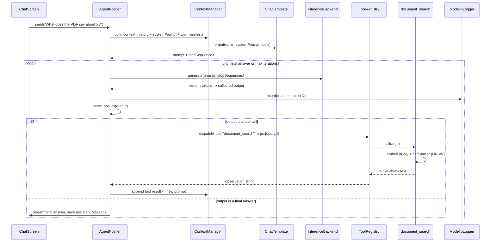
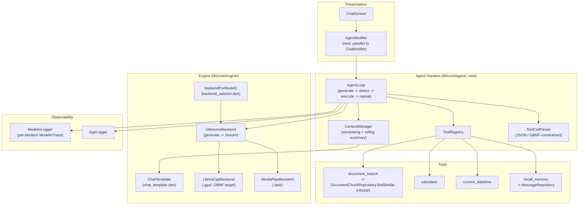

# Agent Harness Architecture

> **Target design** for evolving Loki LLM from single-turn chat into a tool-using agent loop, entirely on-device.

**Status:** Design / forward-looking. This document describes the *target* architecture and the incremental path to it from today's code. It does **not** describe code that exists yet, except where it explicitly cites current files with `file:line` references.

---

## Table of Contents

1. [Overview](#1-overview)
2. [Components](#2-components)
   - [2.1 Prompt / Chat-Template Layer](#21-prompt--chat-template-layer)
   - [2.2 Tool Abstraction & Registry](#22-tool-abstraction--registry)
   - [2.3 The Agent Loop](#23-the-agent-loop)
   - [2.4 Structured / Constrained Output](#24-structured--constrained-output)
   - [2.5 Context & Memory Management](#25-context--memory-management)
   - [2.6 Streaming & Cancellation](#26-streaming--cancellation)
   - [2.7 Observability](#27-observability)
3. [Tool Interface Design](#3-tool-interface-design)
4. [Flow Diagrams](#4-flow-diagrams)
5. [Model-Size Reality](#5-model-size-reality)
6. [Risks & Failure Modes](#6-risks--failure-modes)

---

## 1. Overview

Today, a chat turn is a single linear pass: build a prompt, stream tokens, save the message. The whole flow lives in `ChatNotifier.send()` at `lib/features/chat/presentation/chat_notifier.dart:60`:

1. Persist the user message (`chat_notifier.dart:79`).
2. Optionally retrieve RAG chunks via HNSW (`chat_notifier.dart:110-128`).
3. Build a flat prompt with `_buildPrompt()` (`chat_notifier.dart:249`), which uses a naive `Human:/Assistant:` format (`chat_notifier.dart:272`).
4. Call `backend.generate(prompt)` once and stream tokens to the UI (`chat_notifier.dart:189-239`).
5. On `onDone`, save the assistant message (`chat_notifier.dart:208-227`).

The agent harness keeps this exact shape for the common case but wraps step 4 in a **loop**: the model can emit a *tool call* instead of (or before) a final answer, the harness executes the tool, appends the result to the working context, and re-invokes the model. The loop terminates when the model produces a plain answer or a max-iteration cap is hit.

**Incremental evolution.** Each step below is independently shippable and leaves single-turn chat working:

| Step | Change | Touches |
| --- | --- | --- |
| 0 (today) | Single-turn `send()` | `chat_notifier.dart:60` |
| 1 | Replace `_buildPrompt()` naive format with a per-model `ChatTemplate` | promote `lib/core/engine/chat_template.dart` |
| 2 | Add `stopSequences` to backend `generate()` so turns end cleanly | `LlamaCppBackend.generate` (`lib/core/engine/llama_cpp_backend.dart:50`) |
| 3 | Introduce `Tool` interface + `ToolRegistry` (no loop yet) | new `lib/core/agent/` |
| 4 | Wrap generation in `AgentLoop` (generate → detect → execute → repeat) | new `AgentNotifier` alongside `ChatNotifier` |
| 5 | Add GBNF-constrained tool-call decoding for small models | requires plugin surface in `flutter_llama` |
| 6 | Rolling summary for long conversations | extends context manager |

The agent loop is **opt-in per conversation** (see [§5](#5-model-size-reality)); a 270M model continues to run the plain `send()` path.

---

## 2. Components

### 2.1 Prompt / Chat-Template Layer

The current `_buildPrompt()` (`chat_notifier.dart:249`) emits a generic `Human:/Assistant:` transcript. Instruction-tuned models are trained against a specific turn syntax and only behave reliably when fed that exact format. The spike at `lib/core/engine/chat_template.dart` already demonstrates the target: `ChatTemplate.forModelId()` (`chat_template.dart:25`) selects a `ChatTemplateKind` (gemma / phi3 / llama3 / generic) and `format()` (`chat_template.dart:41`) renders the model-specific control tokens — e.g. Gemma's `<start_of_turn>model` (`chat_template.dart:66`), Phi-3's `<|assistant|>` (`chat_template.dart:81`), Llama-3's `<|start_header_id|>` (`chat_template.dart:97`).

Critically, each kind also declares its **stop sequences** (`chat_template.dart:34`): `<end_of_turn>`, `<|end|>`, `<|eot_id|>`. These map directly onto `GenerationParams.stopSequences` (`local_packages/flutter_llama/lib/src/models/generation_params.dart:22`), which the current `LlamaCppBackend.generate()` does not yet pass (`lib/core/engine/llama_cpp_backend.dart:50-58`).

**Target shape.** The template layer becomes the single place that turns `(history, systemPrompt, ragChunks, toolDefinitions)` into a prompt string plus a stop-sequence list. The catalog models it must support (`lib/features/models/data/model_catalog.dart:5`) are Gemma 3 270M, Phi-3 Mini, and Llama 3.2 3B — exactly the three non-generic kinds in the spike.

### 2.2 Tool Abstraction & Registry

A **`Tool`** is a named, self-describing capability with JSON-schema parameters and an async executor (full interface in [§3](#3-tool-interface-design)). A **`ToolRegistry`** holds the tools enabled for a conversation, exposes their schemas for prompt injection, and dispatches a parsed tool call to the right `Tool.call(args)`.

The registry produces two artifacts each turn:

- **Tool manifest** — a compact JSON/textual description of available tools, injected into the system section of the prompt by the template layer.
- **Dispatch map** — `name → Tool`, used by the loop to execute a detected call.

Tools are constructed from existing Riverpod providers so they reuse live app state — e.g. the RAG tool wraps `documentChunkRepositoryProvider.findSimilar()` (`lib/features/documents/data/document_chunk_repository.dart:29`) and `embeddingServiceProvider`, the same dependencies `send()` already reads (`chat_notifier.dart:111-119`).

### 2.3 The Agent Loop

The loop is the heart of the harness. Pseudocode:

```
context = template.format(history, systemPrompt, ragChunks, registry.manifest)
for iteration in 0 ..< maxIterations:          # hard cap, e.g. 5
    output = await collect(backend.generate(context, stopSequences))
    call = parseToolCall(output)               # null if plain answer
    if call == null:
        return output                          # final answer → save as assistant message
    if !registry.has(call.name):
        context += formatToolError(call, "unknown tool")   # hallucinated tool
        continue
    result = await registry.dispatch(call)     # Future<String>
    context += template.formatToolResult(call, result)     # append observation
# cap reached → return best-effort answer + flag for observability
```

Key properties:

- **Max-iteration cap** prevents infinite tool loops (`maxIterations`, see [§6](#6-risks--failure-modes)).
- **One model loaded at a time** still holds — the loop re-invokes the *same* loaded backend (`InferenceNotifier` via `inferenceNotifierProvider`, read at `chat_notifier.dart:67`); there is no second model.
- **RAG becomes a tool**, not a hard-coded pre-step. The current pre-retrieval at `chat_notifier.dart:110-128` is preserved as a fallback path for the non-agent flow, but in the loop the model *chooses* to call the document-search tool.
- **Persistence boundary.** Intermediate tool calls/results are working context only; on a final answer the harness saves one assistant `Message` exactly as `onDone` does today (`chat_notifier.dart:208-227`). Tool transcripts can optionally be persisted for replay.

This lives in a new `AgentNotifier` (parallel to `ChatNotifier`) so the simple path is untouched.

### 2.4 Structured / Constrained Output

The loop must reliably tell "tool call" apart from "final answer." Two layers, weakest-to-strongest:

1. **Convention + parsing.** The model is instructed to emit a tool call as a fenced JSON object, e.g. `{"tool":"document_search","args":{"query":"..."}}`. `parseToolCall()` attempts a JSON decode of the first balanced object; anything else is treated as a final answer. Cheap, but small models emit malformed JSON often.
2. **Stop sequences.** Using the template's stop sequences (`chat_template.dart:34`) plus a sentinel before the JSON keeps the model from rambling past the call. Requires threading `stopSequences` into `GenerationParams` (`generation_params.dart:22`) — supported by the plugin's Dart model but **not yet wired** in `LlamaCppBackend.generate()` (`llama_cpp_backend.dart:50`).
3. **GBNF grammars (the reliability lever).** llama.cpp supports GBNF grammars for constrained decoding — the sampler can only emit tokens that keep the output on a valid JSON-schema-shaped grammar, making malformed tool JSON *structurally impossible*. This is the single biggest reliability win for small models. **It is not yet exposed by `flutter_llama`:** the native generate loop currently stops only on EOS or `maxTokens`, and there is no `grammar` field on `GenerationParams` (`generation_params.dart:24-32`). Exposing a `grammar` parameter through the method channel (`local_packages/flutter_llama/lib/src/flutter_llama.dart:117`) is the enabling work for robust tool use on the 270M/3B tier.

The MediaPipe backend (`lib/core/engine/mediapipe_backend.dart`) has no grammar support, so constrained decoding is a llama.cpp-only capability; `.task` models rely on convention+parsing only.

### 2.5 Context & Memory Management

Today, history is windowed to the last 20 messages in `_buildPrompt()` (`chat_notifier.dart:246`, `chat_notifier.dart:255-257`), the system prompt and RAG context are always kept, and the native backend hard-truncates anything beyond the 2048-token context window (`LlamaConfig.contextSize`, `lib/core/engine/llama_cpp_backend.dart:21`). A `~4 chars/token` heuristic logs likely overflow (`chat_notifier.dart:137-139`).

The agent loop adds pressure: each iteration appends a tool call + result, so a fixed message window is insufficient. Target strategy:

- **History windowing** (keep) — most-recent-N turns, preserving system prompt + RAG, extended to also preserve the *current* tool transcript.
- **Rolling summary** — when the windowed context approaches `contextSize`, summarize the dropped older turns into a compact running summary (itself produced by the model on a side call) and prepend it as pseudo-system context. This bounds total tokens regardless of conversation length.
- **Budgeting** — the context manager owns a token budget split across {summary, system, RAG, recent turns, tool transcript} and trims lowest-priority sections first.

### 2.6 Streaming & Cancellation

Streaming is `Stream<String>` end-to-end: `InferenceBackend.generate()` returns it (`lib/core/engine/inference_backend.dart:10`), `ChatNotifier` listens and pushes each token into UI state (`chat_notifier.dart:189-203`), with a 60-second per-token timeout (`chat_notifier.dart:191`) and `_tokenSub` cancellation on dispose (`chat_notifier.dart:51`).

**Current limitation — Stop cannot interrupt llama.cpp generation.** The Dart side cancels its subscription, but the native llama.cpp loop does not stop on cancel: `nativeGenerateStreamInit` (the native counterpart behind `generateStream`, `local_packages/flutter_llama/lib/src/flutter_llama.dart:117`) **pre-generates all tokens** before/while streaming them over the event channel. There is a `stopGeneration()` method (`flutter_llama.dart:213`), but because generation is front-loaded, hitting Stop only stops *delivery*, not *compute* — the model keeps running to `maxTokens` or EOS. The MediaPipe backend does honor `stopGeneration()` cooperatively (`lib/core/engine/mediapipe_backend.dart:55`).

For the agent loop this matters more than for single-turn chat: a runaway loop wastes compute per iteration. Target fix: a truly cooperative native stop flag checked inside the token loop, so both Stop and the iteration cap can abort generation promptly. Until then, the iteration cap is the primary guard.

### 2.7 Observability

Every model exchange is already traced by `ModelIoLogger` (`lib/core/logging/model_io_logger.dart`), which records a `ModelIoTrace` (`lib/core/logging/model_io_trace.dart:22`) capturing the exact `inputPrompt`, `generationParams`, RAG state, `outputText`, token count, time-to-first-token, duration, and `TraceOutcome` (`model_io_trace.dart:4`). It is zero-cost when disabled (`model_io_logger.dart:29,50`) and persists JSONL to disk (`model_io_logger.dart:62`). `ChatNotifier.send()` snapshots inputs and emits one trace per generation (`chat_notifier.dart:149-181`).

**Target extension.** The agent loop records **one trace per loop iteration**, so a multi-step run produces a readable chain: prompt → tool call → tool result → next prompt. Adding `iteration`, `toolName`, and `toolArgs`/`toolResult` fields to `ModelIoTrace` makes the whole agent run inspectable in the existing Model I/O viewer with no new infrastructure. `AppLogger` (`lib/core/logging/app_logger.dart`) continues to carry the human-readable breadcrumbs, including the pre-native flush (`chat_notifier.dart:186-187`) that survives a native crash.

---

## 3. Tool Interface Design

```dart
/// A capability the agent can invoke during the loop.
abstract class Tool {
  /// Stable identifier the model emits, e.g. "document_search".
  String get name;

  /// One-line description injected into the tool manifest.
  String get description;

  /// JSON Schema for the arguments object. Drives both the manifest
  /// and (later) the GBNF grammar for constrained decoding.
  Map<String, Object?> get parametersSchema;

  /// Execute the call. Returns a string observation appended to context.
  /// Must never throw — errors are returned as a descriptive string so the
  /// loop can recover (mirrors the non-fatal RAG handling in send()).
  Future<String> call(Map<String, Object?> args);
}
```

Design notes:

- **`Future<String> call(args)`** keeps the loop simple: every observation is text the template appends. This matches how RAG chunks are already folded into the prompt as text (`chat_notifier.dart:264-269`).
- **`parametersSchema`** is the contract shared by the manifest and the GBNF grammar ([§2.4](#24-structured--constrained-output)), so there is one source of truth.
- **Never-throw** mirrors the existing "retrieval failure is non-fatal, continue" pattern (`chat_notifier.dart:121-124`).

### Example tools

| Tool | `name` | Backed by | Notes |
| --- | --- | --- | --- |
| RAG document search | `document_search` | `DocumentChunkRepository.findSimilar()` (`document_chunk_repository.dart:29`) + `embeddingServiceProvider` | Reuses the HNSW index; args `{query, topK}`; `topK` defaults from settings (`chat_notifier.dart:116`). |
| Calculator | `calculator` | pure Dart expression eval | args `{expression}`; deterministic, no model round-trip needed. |
| Datetime | `current_datetime` | `DateTime.now()` | args `{}` or `{timezone}`; gives the model wall-clock awareness it otherwise lacks. |
| Conversation memory | `recall_memory` | `MessageRepository` (`lib/features/chat/data/message_repository.dart`) | Searches/returns earlier turns beyond the active window — pairs with the rolling summary ([§2.5](#25-context--memory-management)). |

The calculator and datetime tools are intentionally trivial: they make the loop testable end-to-end before grammar support lands, and they give small models reliable wins (arithmetic and "today's date" are classic LLM failure modes).

---

## 4. Flow Diagrams

### 4.1 Agent loop with a tool call (sequence)



### 4.2 Component diagram



---

## 5. Model-Size Reality

Tool use and multi-step loops are not free: every iteration is a full generation, and small models follow instructions poorly. The catalog (`lib/features/models/data/model_catalog.dart:5`) spans a 10x size range:

| Model | Size | Agent role |
| --- | --- | --- |
| Gemma 3 270M IT (`model_catalog.dart:8`) | ~265 MB | **Plain chat only.** Too small to reliably emit valid tool JSON or reason over observations. Stays on the single-turn `send()` path. |
| Phi-3 Mini 4K (`model_catalog.dart:17`) | ~2.4 GB | Capable of simple tool calls with GBNF constraints; treat as opt-in/experimental. |
| Llama 3.2 3B (`model_catalog.dart:26`) | ~2.0 GB | **Primary agent target.** Tools, loops, and constrained decoding aim here. |

**Selectable per conversation.** `Conversation` already carries `modelId` and a `ragEnabled` flag (`lib/features/chat/domain/conversation.dart:16,17`). The agent mode follows the same pattern: an `agentEnabled` (or `mode`) flag on `Conversation` routes the conversation to `AgentNotifier` vs `ChatNotifier`. The UI should default to plain chat for the 270M model and only offer agent mode when a 3B-class model is loaded — keeping the small-model experience fast and predictable.

---

## 6. Risks & Failure Modes

| Risk | How it manifests | Mitigation |
| --- | --- | --- |
| **Infinite tool loops** | Model calls a tool every iteration, never answers. | Hard `maxIterations` cap in the loop ([§2.3](#23-the-agent-loop)); on cap, return a best-effort answer and flag the trace. Detect repeated identical calls and short-circuit. |
| **Malformed tool JSON** | Small model emits unparseable `{...}`; `parseToolCall()` fails. | Layered defense: JSON parse → stop sequences → **GBNF grammar** makes invalid JSON structurally impossible ([§2.4](#24-structured--constrained-output)). On unrecoverable parse failure, append an error observation and let the model retry (counts against the cap). |
| **Context overflow** | Loop appends tool transcripts until prompt exceeds 2048-token `contextSize` (`llama_cpp_backend.dart:21`); native backend silently truncates. | Token-budgeted context manager + rolling summary ([§2.5](#25-context--memory-management)); the existing `~4 chars/token` overflow log (`chat_notifier.dart:137-139`) becomes an active trim trigger. |
| **Hallucinated tools** | Model invokes a tool name not in the registry. | `ToolRegistry.has(name)` check before dispatch ([§2.3](#23-the-agent-loop)); unknown tool → error observation listing valid tools, not a crash. Grammar can restrict `tool` to the enum of registered names. |
| **Runaway compute on Stop** | User hits Stop but llama.cpp keeps generating (tokens pre-generated, `flutter_llama.dart:117`). | Short-term: iteration cap + low `maxTokens` (`llama_cpp_backend.dart:35`). Long-term: cooperative native stop flag ([§2.6](#26-streaming--cancellation)). |
| **Tool execution errors** | `findSimilar` throws, file missing, etc. | `Tool.call()` never throws ([§3](#3-tool-interface-design)); errors return as observation strings (mirrors non-fatal RAG handling, `chat_notifier.dart:121-124`). |
| **Wrong chat template** | Generic `Human:/Assistant:` format degrades instruction-tuned models. | Per-model `ChatTemplate` ([§2.1](#21-prompt--chat-template-layer)) + correct stop sequences (`chat_template.dart:34`). |
